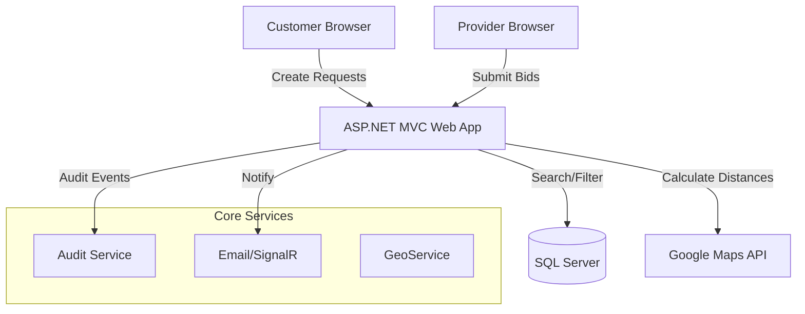
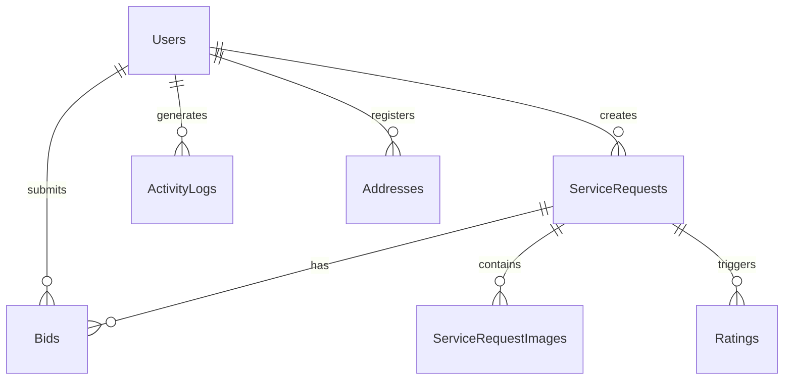

# OnCall Platform System Documentation

Welcome to the comprehensive technical documentation for the **OnCall Solutions** ecosystem. This platform connects professional service providers with customers across South Africa using location-aware matching and trust-based analytics.

---

## 🏛️ System Architecture

Our architecture is designed for low-latency interactions and high traceability.



---

## 🔑 Key Features

### 1. Geographic Proximity Filtering
The system ensures relevance by calculating the distance between the **Job Site** and the **Provider's Base**.
- **Technology**: Haversine Formula (Earth Radius in KM).
- **Control**: Providers only see "Nearby Opportunities" (Default 50km radius).
- **Interface**: Distance displayed as a real-time "Route" badge on lead cards.

### 2. Audit Trail & Enterprise Logging
Every business-critical action is recorded for transparency and troubleshooting.
- **Log Types**: Authentication, Financial (Payments/Bids), Job Lifecycle (Creation/Completion).
- **Admin View**: Searchable user activity logs with chronological modal displays.

### 3. Engagement & Trust Metrics
- **Bid Analytics**: Real-time tracking of view counts and bid counts.
- **Supplier Ratings**: 5-star rating system with verified customer reviews. Average ratings are visible to customers during bid selection.

---

## 💾 Data Model (ER)

The following diagram illustrates the core relationships in the **OnCall** database:



---

## 🎨 Visual Identity & Design System

The system uses a **Modern Blue & Slate** professional aesthetic with a glassmorphism-inspired UI.

### UI Tokens:
- **Primary**: `#4F46E5` (Indigo-inspired Professional Blue)
- **Secondary**: `#Deep Slate` (Headers)
- **Background**: White with subtle greyish overlays for card distinction.
- **Animations**: "Fade-up" entry effects for all dashboard sections.

### Job Opportunity Card Preview:
```text
+------------------------------------------+
|  [Category]  [Distance KM]  [Live Feed]  |
|  Title: Plumbing Emergency               |
|  "My sink is leaking..."                 |
|  [Submit Bid] [Views: 12] [Bids: 3]      |
+------------------------------------------+
```

---

## 🚀 Workflows

### The Service Lifecycle
1.  **Posting**: Customer creates a request using Google Places Autocomplete.
2.  **Notification**: System identifies providers in the same Category within 50km.
3.  **Bidding**: Providers view distance-aware leads and submit competitive quotes.
4.  **Selection**: Customer reviews bids, average supplier ratings, and selects a winner.
5.  **Completion**: Job marked as complete; activity logged in Audit Trail.

---

## 🔧 Technical Configuration

### 1. Email Templates
All outbound emails are HTML-templated in the `Templates/` directory, allowing for rich branding and easy content changes without code deployment.

### 2. Externals
- **Maps**: Requires `GoogleMapsApiKey` in `web.config`.
- **Database**: Initialized via `init_db.sql`.
- **SMTP**: Configurable via `web.config` for transactional emails.
